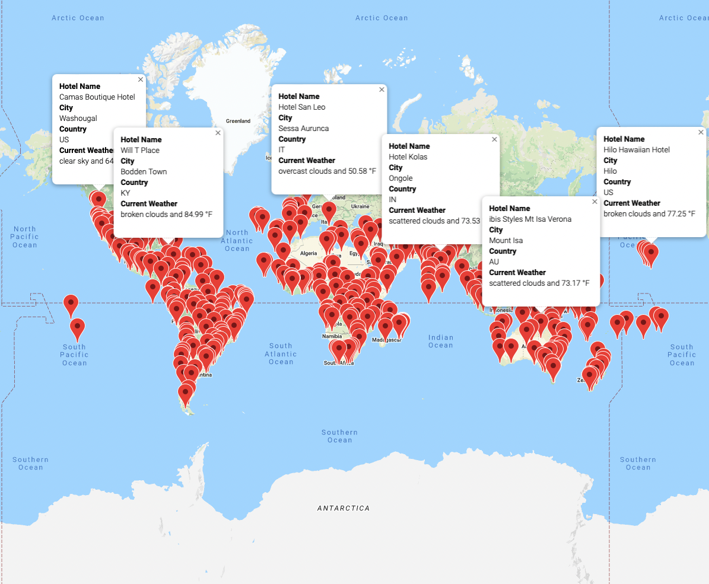
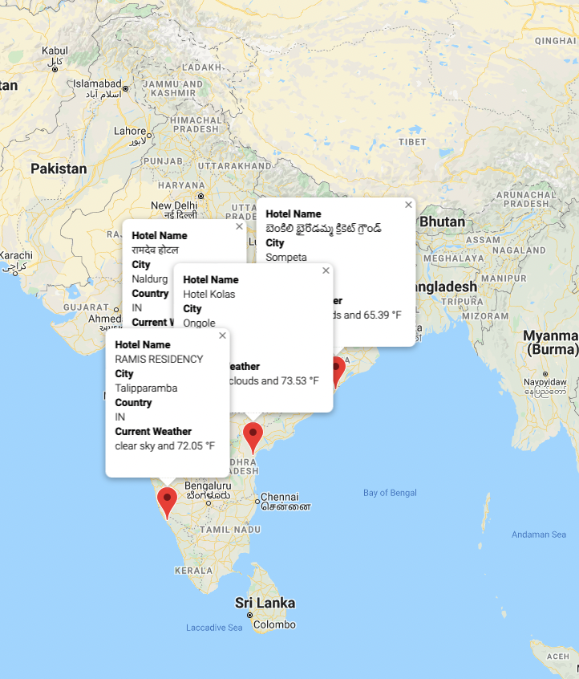
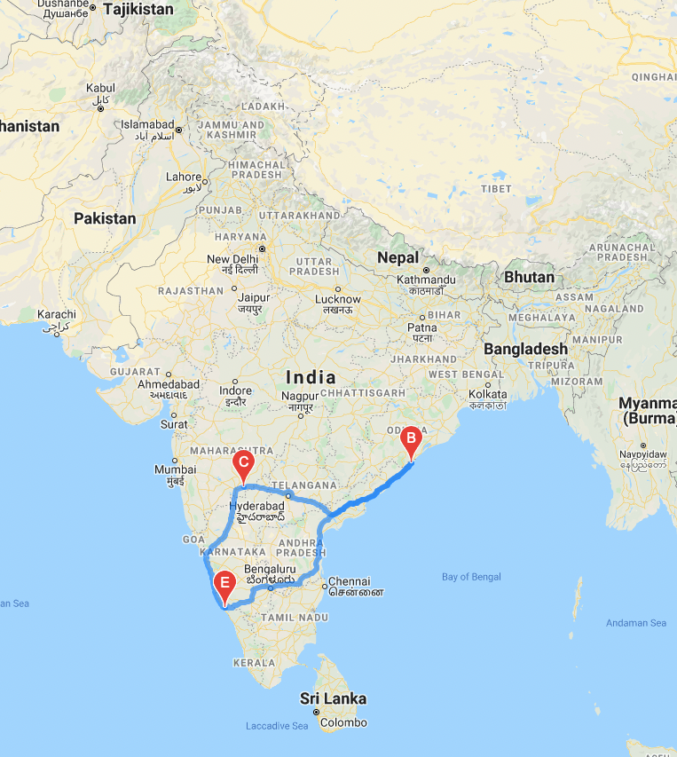

# World_Weather_Analysis

## Overview
- Use random module to generate 2000 random coordinates(Lat, Lng).
- Use citipy module to retrieve nearest cities(with populations more than 500).
- Use OpenWeatherAPI to fetch current weather data from each unique city retrieved in previous step.
- Use Google Map API to create Vacation Map & Itinerary for Potential Travel Destinations.

## Purpose
The purpose of this analysis is to create a vacation map that allows users to apply weather criteria to identify potential travel destinations. By utilizing Google API's, we also provide the user with recommended ideal hotels within there preferred travel destinations.

### World_Weather_Analysis
Source Code: [Weather_Database.ipynb](https://github.com/crdhilep/World_Weather_Analysis/blob/main/Weather_Database/Weather_Database.ipynb) 

### Vacation_Search_Analysis
Source Code: [Vacation_Search.ipynb](https://github.com/crdhilep/World_Weather_Analysis/blob/main/Vacation_Search/Vacation_Search.ipynb)

### Travel_Itinerary_Analysis
Source Code: [Vacation_Itinerary.ipynb](https://github.com/crdhilep/World_Weather_Analysis/blob/main/Vacation_Itinerary/Vacation_Itinerary.ipynb)

#### Vacation plans:

